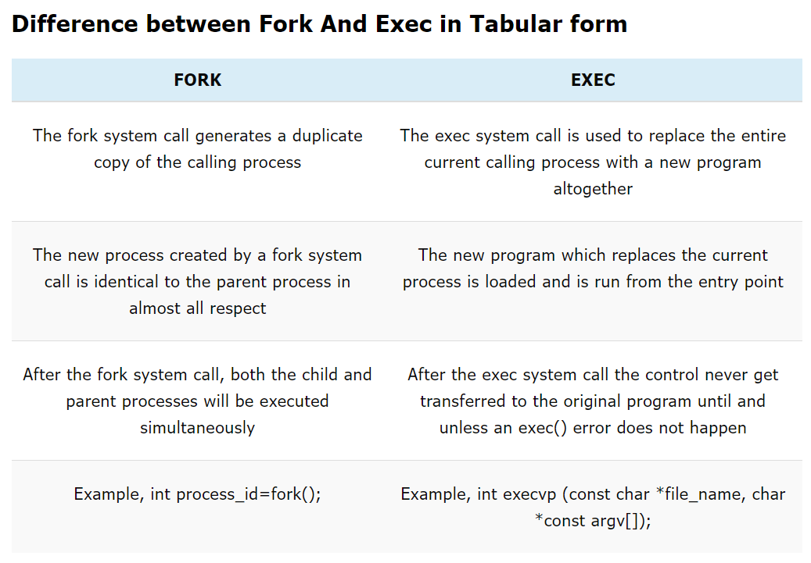

Linux System Administrator/DevOps Interview Questions
====================================================

A collection of linux sysadmin/devops interview questions. Feel free to contribute via pull requests, issues or email messages.


## <a name='toc'>Table of Contents</a>

  1. [Contributors](#contributors)
  1. [General Questions](#general)
  1. [Simple Linux Questions](#simple)
  1. [Medium Linux Questions](#medium)
  1. [Hard Linux Questions](#hard)
  1. [Expert Linux Questions](#expert)
  1. [Networking Questions](#network)
  1. [MySQL Questions](#mysql)
  1. [DevOps Questions](#devop)
  1. [Fun Questions](#fun)
  1. [Demo Time](#demo)
  1. [Other Great References](#references)


#### [[⬆]](#toc) <a name='contributors'>Contributors:</a>

* [moregeek](https://github.com/moregeek)
* [typhonius](https://github.com/typhonius)
* [schumar](https://github.com/schumar)
* [negesti](https://github.com/negesti)
* peter
* [andreashappe](https://github.com/andreashappe)
* [quatrix](https://github.com/quatrix)
* [biyanisuraj](https://github.com/biyanisuraj)
* [pedroguima](https://github.com/pedroguima)
* Ben
* [bharatnc](https://github.com/bharatnc)


#### [[⬆]](#toc) <a name='general'>General Questions:</a>

* What did you learn yesterday/this week?
* Talk about your preferred development/administration environment. (OS, Editor, Browsers, Tools etc.)
* Tell me about the last major Linux project you finished.
* Tell me about the biggest mistake you've made in [some recent time period] and how you would do it differently today. What did you learn from this experience?
* Why we must choose you?
* What function does DNS play on a network?
* What is HTTP?
* What is an HTTP proxy and how does it work?
* Describe briefly how HTTPS works.
* What is SMTP? Give the basic scenario of how a mail message is delivered via SMTP.
* What is RAID? What is RAID0, RAID1, RAID5, RAID10?
* What is a level 0 backup? What is an incremental backup?
```sh
Types of backup:
- incremental 
- full
- differential
```
* Describe the general file system hierarchy of a Linux system.
* Which difference have between public and private SSH key?
```sh
Public key is shared across unprotected network. It is used for encrypting data in asynchronous encryption.
```

#### [[⬆]](#toc) <a name='simple'>Simple Linux Questions:</a>

* What is the name and the UID of the administrator user?
* How to list all files, including hidden ones, in a directory?
* What is the Unix/Linux command to remove a directory and its contents?
* Which command will show you free/used memory? Does free memory exist on Linux?
* How to search for the string "my konfu is the best" in files of a directory recursively?
* How to connect to a remote server or what is SSH?
* How to get all environment variables and how can you use them?
* I get "command not found" when I run ```ifconfig -a```. What can be wrong?
* What happens if I type TAB-TAB?
* What command will show the available disk space on the Unix/Linux system?
* What commands do you know that can be used to check DNS records?
* What Unix/Linux commands will alter a files ownership, files permissions?
* What does ```chmod +x FILENAME``` do?
* What does the permission 0750 on a file mean?
* What does the permission 0750 on a directory mean?
* How to add a new system user without login permissions?
* How to add/remove a group from a user?
```sh
# remove user from group
usermod -aG <group> <user>
```

* What is a bash alias?
```sh
#  Alias = short version of command, shortcut command for a longer command.
alias alias_name="command_to_run"
# To make the alias persistent you need to declare it in the ~/.bash_profile or ~/.bashrc file.

# You can create alias with parameters (function):
function_name () {
  [commands]
}
# The passed parameters are $1, $2, $3, etc.,

```
* Why is `--` used before argument?
```sh
-- - makes sure you’re not accidentally passing an extra argument to the command. For example, if you try to create a directory that starts with - (dash) without using -- the directory name will be interpreted as a command argument.

```

* How do you set the mail address of the root/a user?
```sh
# => Way #1
vi /etc/aliases
# find in file:
root: system@mydmomain.com
# add email
root: system@mydomain.com, linux@mydomain.com
# run command to compile aliases file
newaliases
# restart postfix server
service postfix restart

# => Way #2
# We can simply create .forward file to the folder root and add email address there.
vi /root/.forward
# Restart postfix server
service postfix restart
```
* What does CTRL-c do?
```sh
Ctrl+C kills the process with SIGINT, which terminates the process unless it is handled/ignored by the target, so you can't resume it.
```
* What does CTRL-d do?
```sh
The ctrl-d sequence closes the terminal window or end terminal line input.
```
* What does CTRL-z do?
```sh
Control+Z is used for suspending a process by sending it the signal SIGSTOP, which cannot be intercepted by the program
If you suspend a process, this will show up in the shell to tell you it has been suspended
```
* What is in /etc/services?
```sh
# It's a database of well-known ports with symbolic names; any program that can take a port number # should be able to take the appropriate symbolic name instead. 

# The format of the /etc/services is simple: 
service_name port/protocol aliases
# Example 
smtp 25/tcp mail
ssh 22/tcp
ftp 21/tcp
ftp-data 20/tcp
telnet 23/tcp

```
* How to redirect STDOUT and STDERR in bash? (> /dev/null 2>&1)
```sh
# redirect STDOUT 
command 1> file

# redirect STDERR
command 2> file

# redirect STDERR to STDOUT
command 2>&1
# or 
command &> filename
```
* What is the difference between UNIX and Linux.

| Linux | Unix |
| :---: | :---: |
| Linux refers to the kernel of the GNU/Linux operating system. More generally, it refers to the family of derived distributions. | Unix refers to the original operating system developed by AT&T. More generally, it refers to family of derived operating systems. |
| It is an open-source operating system which is freely available to everyone. | It is an operating system which can be only used by its copyrighters. |
| It has different distros like Ubuntu, Redhat, Fedora, etc |  IBM AIX, HP-UX and Sun Solaris. |
| Linux is just the kernel. | Unix is a complete package of Operating system. |
| text | text |
* What is the difference between Telnet and SSH?
```sh
#1 
Telnet is the standard TCP/IP protocol for virtual terminal service, while SSH or Secure Shell is a program to log into another computer over a network to execute commands in a remote machine.

#2 
Telnet is vulnerable to security attacks while SSH helps you to overcome many security issues of Telnet .

#3 
Telnet uses port 23, which was designed specifically for local area networks, whereas SSH runs on port 22 by default.

#4 
Telnet transfers the data in plain text while in SSH data is sent in encrypted format via a secure channel.
```
* Explain the three load averages and what do they indicate. What command can be used to view the load averages?
```sh
To see load averages numbers you can run commands:
$ top (see load average section)

$ cat /proc/loadavg
1.00 1.01 0.98 2/198 21533

$ uptime
18:37:28 up 4 days,  7:17,  4 users,  load average: 1.00, 1.01, 0.98

The three numbers after load average -  1.00, 1.01, 0.98 - represent the 1-, 5-, and 15-minute load averages on the machine. A system load average is equal to the average number of processes in a runnable or uninterruptible state. Runnable processes are either currently using the CPU or waiting to do so, and uninterruptible processes are waiting for I/O.
```
* Can you name a lower-case letter that is not a valid option for GNU ```ls```?
```sh
# j, y
Mandatory arguments to long options are mandatory for short options too.
  -a, --all                  do not ignore entries starting with .
  -A, --almost-all           do not list implied . and ..
      --author               with -l, print the author of each file
  -b, --escape               print C-style escapes for nongraphic characters
      --block-size=SIZE      with -l, scale sizes by SIZE when printing them;
                               e.g., '--block-size=M'; see SIZE format below
  -B, --ignore-backups       do not list implied entries ending with ~
  -c                         with -lt: sort by, and show, ctime (time of last
                               modification of file status information);
                               with -l: show ctime and sort by name;
                               otherwise: sort by ctime, newest first
  -C                         list entries by columns
      --color[=WHEN]         colorize the output; WHEN can be 'always' (default
                               if omitted), 'auto', or 'never'; more info below
  -d, --directory            list directories themselves, not their contents
  -D, --dired                generate output designed for Emacs dired mode
  -f                         do not sort, enable -aU, disable -ls --color
  -F, --classify             append indicator (one of */=>@|) to entries
      --file-type            likewise, except do not append '*'
      --format=WORD          across -x, commas -m, horizontal -x, long -l,
                               single-column -1, verbose -l, vertical -C
      --full-time            like -l --time-style=full-iso
  -g                         like -l, but do not list owner
      --group-directories-first
                             group directories before files;
                               can be augmented with a --sort option, but any
                               use of --sort=none (-U) disables grouping
  -G, --no-group             in a long listing, do not print group names
  -h, --human-readable       with -l and -s, print sizes like 1K 234M 2G etc.
      --si                   likewise, but use powers of 1000 not 1024
  -H, --dereference-command-line
                             follow symbolic links listed on the command line
      --dereference-command-line-symlink-to-dir
                             follow each command line symbolic link
                               that points to a directory
      --hide=PATTERN         do not list implied entries matching shell PATTERN
                               (overridden by -a or -A)
      --hyperlink[=WHEN]     hyperlink file names; WHEN can be 'always'
                               (default if omitted), 'auto', or 'never'
      --indicator-style=WORD  append indicator with style WORD to entry names:
                               none (default), slash (-p),
                               file-type (--file-type), classify (-F)
  -i, --inode                print the index number of each file
  -I, --ignore=PATTERN       do not list implied entries matching shell PATTERN
  -k, --kibibytes            default to 1024-byte blocks for disk usage;
                               used only with -s and per directory totals
  -l                         use a long listing format
  -L, --dereference          when showing file information for a symbolic
                               link, show information for the file the link
                               references rather than for the link itself
  -m                         fill width with a comma separated list of entries
  -n, --numeric-uid-gid      like -l, but list numeric user and group IDs
  -N, --literal              print entry names without quoting
  -o                         like -l, but do not list group information
  -p, --indicator-style=slash
                             append / indicator to directories
  -q, --hide-control-chars   print ? instead of nongraphic characters
      --show-control-chars   show nongraphic characters as-is (the default,
                               unless program is 'ls' and output is a terminal)
  -Q, --quote-name           enclose entry names in double quotes
      --quoting-style=WORD   use quoting style WORD for entry names:
                               literal, locale, shell, shell-always,
                               shell-escape, shell-escape-always, c, escape
                               (overrides QUOTING_STYLE environment variable)
  -r, --reverse              reverse order while sorting
  -R, --recursive            list subdirectories recursively
  -s, --size                 print the allocated size of each file, in blocks
  -S                         sort by file size, largest first
      --sort=WORD            sort by WORD instead of name: none (-U), size (-S),
                               time (-t), version (-v), extension (-X)
      --time=WORD            with -l, show time as WORD instead of default
                               modification time: atime or access or use (-u);
                               ctime or status (-c); also use specified time
                               as sort key if --sort=time (newest first)
      --time-style=TIME_STYLE  time/date format with -l; see TIME_STYLE below
  -t                         sort by modification time, newest first
  -T, --tabsize=COLS         assume tab stops at each COLS instead of 8
  -u                         with -lt: sort by, and show, access time;
                               with -l: show access time and sort by name;
                               otherwise: sort by access time, newest first
  -U                         do not sort; list entries in directory order
  -v                         natural sort of (version) numbers within text
  -w, --width=COLS           set output width to COLS.  0 means no limit
  -x                         list entries by lines instead of by columns
  -X                         sort alphabetically by entry extension
  -Z, --context              print any security context of each file
  -1                         list one file per line.  Avoid '\n' with -q or -b
```
* What is ICMP protocol? Why do you need to use?
```sh
The Internet Control Message Protocol (ICMP) is a protocol that devices within a network use to communicate problems with data transmission. In this ICMP definition, one of the primary ways in which ICMP is used is to determine if data is getting to its destination and at the right time. This makes ICMP an important aspect of the error reporting process and testing to see how well a network is transmitting data. However, it can also be used to execute distributed denial-of-service (DDoS) attacks.
```

* What is a Linux kernel module?
* Walk me through the steps in booting into single user mode to troubleshoot a problem.
* Walk me through the steps you'd take to troubleshoot a 404 error on a web application you administer.

#### [[⬆]](#toc) <a name='medium'>Medium Linux Questions:</a>

* What do the following commands do and how would you use them?
 * ```tee```
 ```sh
#  tee - read from standard input and write to standard output and files
# For example you can use this command like this:
$ echo "deb http://pkg.jenkins-ci.org/debian binary/" | sudo  tee -a /etc/apt/sources.list.d/jenkins.list
 ```
 * ```awk```
 ```sh
# The awk is most useful when handling text files that are formatted in a predictable way. For instance, it is excellent at parsing and manipulating tabular data. It operates on a line-by-line basis and iterates through the entire file.
# The awk syntax looks like this:
awk '/search_pattern/ { action_to_take_on_matches; another_action; }' file_to_parse

# For example you can use this command like this:
$ awk '{print}' /etc/fstab
 ```
 * ```tr```
 ```sh
# We can use tr for translating, or deleting, or squeezing repeated characters.
# It will read from STDIN and write to STDOUT.

# For example you can use this command like this:
$ tr a-z A-Z
$ tr '()' '{}'
 ```
 * ```cut```
 ```sh
# The command cut is used for text processing.
# We can use this command to extract portion of text from a file by selecting columns.
cut OPTION... [FILE]...

# For example you can use this command like this:
# The example displays only the first field of each lines from /etc/passwd file using the field delimiter : (colon). In this case, the 1st field is the username.
$ cut -d ':' -f 1 < /etc/passwd
```
 * ```tac```
 ```sh
# tac (which is "cat" backwards) concatenate and print files in reverse
# For example you can use this command like this:
$ cat ok
1
2
3

$ tac ok
3
2
1
```
 * ```curl```
 ```sh
# Curl is a tool to transfer data from or to a server, using one of the supported protocols (DICT, FILE, FTP, FTPS, GOPHER, HTTP, HTTPS, IMAP, IMAPS, LDAP, LDAPS, POP3, POP3S, RTMP, RTSP, SCP, SFTP, SMTP, SMTPS, TELNET and TFTP).  The command is designed to work without user interaction.
# For example you can use this command like this:
$ curl https://example.com
 ```
 * ```wget```
 ```sh
# Wget is a free utility for non-interactive download of files from the Web.
# It supports HTTP, HTTPS, and FTP protocols, as well as retrieval through HTTP proxies.
# Wget is non-interactive, meaning that it can work in the background, while the user is not logged on.
# This allows you to start a retrieval and disconnect from the system, letting Wget finish the work.
# By contrast, most of the Web browsers require constant user's presence, which can be a great hindrance when transferring a lot of data.
# For example you can use this command like this:
$ wget -S https://example.com
 ```
 * ```watch```
 ```sh
# watch runs command repeatedly, displaying its output and errors (the first screenfull). This allows you to watch the program output change over time. By default, the program is run every 2 seconds. By default, watch will run until interrupted.
# For example you can use this command like this:
# To watch the contents of a directory change, you could use
$ watch -d ls -l
 ```
 * ```head```
 ```sh
# Print the first 10 lines of each FILE to standard output.
# With more than one FILE, precede each with a header giving the file name.
# With no FILE is read standard input.
# For example you can use this command like this:
# To print first 10 lines
$ head /etc/passws
 ```
 * ```tail```
 ```sh
# Print the last 10 lines of each FILE to standard output.
# With more than one FILE, precede each with a header giving the file name.
# With no FILE is read standard input.
# For example you can use this command like this:
# To print last 10 lines
$ tail /etc/passws
 ```
 * ```less```
 ```sh
# Less  is a program similar to more (1), but it has many more features.  Less does not have to read the entire input file before starting, so with large input files it starts up faster than text editors like vi
 ```
 * ```more```
```sh
# A simple terminal pager
```
 * ```cat```
 ```sh
# Read file and print its content to standard output
# Enumarate lines
cat -n file 
# Delete empty lines
cat -s file
# Concatenate files
cat file1 file2 > result
 ```
 * ```touch```
 ```sh
# Create file
# Update the access and modification times of each FILE to the current time.
$ touch file
 ```
 * ```sar```
 [TODO](https://rtfm.co.ua/linux-utilita-sar-opisanie-primery/)
 ```sh
Входит в пакет sysstat, в которую так же включены:

sar: сбор информации об активности системы;
iostat: отчеты об использовании CPU и статистика I/O;
mpstat: глобальная статистистика и отчеты по каждому процессу;
pidstat: отчеты по процессам в Linux;
sadf: отображение информации от sar в различных форматах;
nfsiostat: статистика I/O для сетевых файловых систем;
cifsiostat:статистика I/O для файловых систем CIFS.

sar предоставляет данные по:

- статистика CPU;
- статистика CPU по отдельным процессам или пользователям;
- использование памяти;
- использование swap;
- I/O активность системы;
- переключения контекстов;
- статистику сетевой активности;
- предоставляет данные за указанный период времени.
 ```
 * ```netstat```
 ```sh
 command-line network utility that displays network connections for TCP, routing tables, network interfaces.
 ```
 * ```tcpdump```
 [TODO](https://danielmiessler.com/study/tcpdump/)
 ```sh
# tcpdump is the tool everyone should learn as their base for packet analysis.
 ```
 * ```lsof```
 [TODO](https://www.tecmint.com/10-lsof-command-examples-in-linux/)
 ```sh
 # lsof meaning ‘LiSt Open Files’ is used to find out which files are open by which process.
 ```
* What does an ```&``` after a command do?
```sh
# This is known as job control under unix. The & informs the shell to put the command in the background.
# This means it continues to run the command but returns you to your shell to allows you to continue doing parallel commands and do not have to wait until the script is finished. If you forget to add & after command, you can stop the current running process with Ctrl-Z and continue it in the background with bg (or in the foreground with fg).
```
* What does ```& disown``` after a command do?
```sh
# & puts the job in the background, that is, makes it block on attempting to read input, and makes the shell not wait for its completion.

# disown removes the process from the shell's job control, but it still leaves it connected to the terminal. One of the results is that the shell won't send it a SIGHUP. Obviously, it can only be applied to background jobs, because you cannot enter it when a foreground job is running.
```
* What is a packet filter and how does it work?
```sh
Packet filters act by inspecting the "packets" which are transferred between computers on the Internet. If a packet does not match the packet filter's set of filtering rules, the packet filter will drop.
```
* What is Virtual Memory?
```sh
In computing, virtual memory is a memory management technique that is implemented using both hardware and software. It maps memory addresses used by a program, called virtual addresses, into physical addresses in computer memory. Main storage as seen by a process or task appears as a contiguous address space or collection of contiguous segments. The operating system manages virtual address spaces and the assignment of real memory to virtual memory.
```
* What is swap and what is it used for?
```sh
Swap is a special type of memory.
Swap space in Linux is used when the amount of physical memory (RAM) is full. If the system needs more memory resources and the RAM is full, inactive pages in memory are moved to the swap space. While swap space can help machines with a small amount of RAM, it should not be considered a replacement for more RAM. Swap space is located on hard drives, which have a slower access time than physical memory.
Swapping is a useful technique that enables a computer to execute programs and manipulate data files larger than main memory. The operating system copies as much data as possible into main memory, and leaves the rest on the disk. When the operating system needs data from the disk, it exchanges a portion of data (called a page or segment) in main memory with a portion of data on the disk.
```
* What is an A record, an NS record, a PTR record, a CNAME record, an MX record?
```
Address Mapping records (A)The record A specifies IP address (IPv4) for given host. A records are used for conversion of domain names to corresponding IP addresses.

IP Version 6 Address records (AAAA)The record AAAA (also quad-A record) specifies IPv6 address for given host. So it works the same way as the A record and the difference is the type of IP address.

Canonical Name records (CNAME)The CNAME record specifies a domain name that has to be queried in order to resolve the original DNS query. Therefore CNAME records are used for creating aliases of domain names. CNAME records are truly useful when we want to alias our domain to an external domain. In other cases we can remove CNAME records and replace them with A records and even decrease performance overhead.

Host Information records (HINFO)HINFO records are used to acquire general information about a host. The record specifies type of CPU and OS. The HINFO record data provides the possibility to use operating system specific protocols when two hosts want to communicate. For security reasons the HINFO records are not typically used on public servers.Note: Standard values in RFC 1010

Mail exchanger record (MX)The MX resource record specifies a mail exchange server for a DNS domain name. The information is used by Simple Mail Transfer Protocol (SMTP) to route emails to proper hosts. Typically, there are more than one mail exchange server for a DNS domain and each of them have set priority

Name Server records (NS)The NS record specifies an authoritative name server for given host.

Reverse-lookup Pointer records (PTR)As opposed to forward DNS resolution (A and AAAA DNS records), the PTR record is used to look up domain names based on an IP address.

```
* Are there any other RRs and what are they used for?
* What is a Split-Horizon DNS?
```
Imagine a very common scenario where you have a firewall, and behind that firewall you have a few servers, one of them named api.example.com.  This is most commonly configured with the firewall exposing a public IP address to the Internet, e.g., 1.2.3.4, which connects back to the API server at its internal IP address, e.g., 192.168.3.4.

If you’re outside the firewall and try to connect to the API server, then you need DNS to resolve api.example.com to 1.2.3.4.  But what if you’re also behind the firewall?  This might be the case if you’re a web server, and need to make API calls on behalf of web visitors.  If you try to connect to 1.2.3.4, then you have a problem: your packet is going to go out the firewall and then attempt what is known as a “hairpin turn” to come back in – and this just doesn’t work.

To solve this, the DNS introduced the concept of “views” – different sets of answers for the same record depending upon the source of the resolution request.  In other words, you can configure your DNS service such that if someone outside the firewall asks, “what is the IP address for api.example.com?” you answer, “1.2.3.4”.  But if someone inside the firewall asks the same question, you answer, “192.168.3.4”.  This avoids the whole hairpin turn problem.
```
* What is the sticky bit?
```sh
# A Sticky bit is a permission bit that is set on a file or a directory that lets only the owner of the file/directory or the root user to delete or rename the file. No other user is given privileges to delete the file created by some other user.
$ chmod +t file
```
* What does the immutable bit do to a file?
```sh
# The immutable flag keeps even the root user from deleting a file.
chattr +i file
lsattr file
```
* What is the difference between hardlinks and symlinks? What happens when you remove the source to a symlink/hardlink?
```md
A hard link is merely an additional name for an existing file on Linux or other Unix-like operating systems

Any number of hard links, and thus any number of names, can be created for any file. Hard links can also be created to other hard links. However, they cannot be created for directories, and they cannot cross filesystem boundaries or span across partitions.

`$ ln file hardlink_file`

Soft links is a special kind of file that points to another file, much like a shortcut. Unlike a hard link, a symbolic link does not contain the data in the target file. It simply points to another entry somewhere in the file system. This difference gives symbolic links certain qualities that hard links do not have, such as the ability to link to directories, or to files on remote computers networked through NFS. Also, when you delete a target file, symbolic links to that file become unusable, whereas hard links preserve the contents of the file. 

`$ ln -s file softlink`

# Differences:

A soft link does not contain the data in the target file.
A soft link points to another entry somewhere in the file system.
A soft link has the ability to link to directories, or to files on remote computers networked through NFS.
Deleting a target file for a symbolic link makes that link useless.
A hard link preserves the contents of the file.
A hard link cannot be created for directories, and they cannot cross filesystem boundaries or span across partitions.
In a hardlink you can use any of the hardlink names created to execute a program or script in the same manner as the original name given.

# In essence:

Underneath the file system files are represented by inodes
A file in the file system is basically a link to an inode.
A hard link then just creates another file with a link to the same underlying inode.
When you delete a file it removes one link to the underlying inode. The inode is only deleted (or deletable/over-writable) when all links to the inode have been deleted.
A symbolic link is a link to another name in the file system.

Once a hard link has been made the link is to the inode. deleting renaming or moving the original file will not affect the hard link as it links to the underlying inode. Any changes to the data on the inode is reflected in all files that refer to that inode.


```
* What is an inode and what fields are stored in an inode?
```md
The inode is a data structure in a Unix-style file system which describes a filesystem object such as a file or a directory. Each inode stores the attributes and disk block location(s) of the object’s data.[1] Filesystem object attributes may include metadata (times of last change,[2] access, modification), as well as owner and permission data.[3]

A directory is a list of inodes with their assigned names. The list includes an entry for itself, its parent, and each of its children.

# Attributes:
- Device ID (this identifies the device containing the file; that is, the scope of uniqueness of the serial number).
- File serial numbers.
- The file mode which determines the file type and how the file's owner, its group, and others can access the file.
- A link count telling how many hard links point to the inode.
- The User ID of the file's owner.
- The Group ID of the file.
- The device ID of the file if it is a device file.
- The size of the file in bytes.
- Timestamps telling when the inode itself was last modified (ctime, inode change time), the file content last modified (mtime, modification time), and last accessed (atime, access time).
- The preferred I/O block size.
- The number of blocks allocated to this file.

```
* How to force/trigger a file system check on next reboot?
```sh
# This procedure allows you to schedule a file system check during the next restart of the system by creating a blank file, named forcefsck, that resides in the / directory. The presence of the /forcefsck file causes the system to perform a file system check the next time the system boots.

$ touch /forcefsck

# If you want to restart the system at this time, type the following command:
$ reboot

# Note: The /forcefsck file is deleted as the system boots and does not remain for subsequent restarts.

```
* What is SNMP and what is it used for?
TODO: learn more
```
Simple Network Management Protocol (SNMP) is a networking protocol used for the management and monitoring of network-connected devices in Internet Protocol networks. The SNMP protocol is embedded in multiple local devices such as routers, switches, servers, firewalls, and wireless access points accessible using their IP address.
```
* What is a runlevel and how to get the current runlevel?

```sh
# A runlevel is an operating state on a Unix and Unix-based operating system that is preset on the Linux-based system. Runlevels are numbered from zero to six.

# Runlevels determine which programs can execute after the OS boots up. The runlevel defines the state of the machine after boot.

# Systems administrators set the default runlevel of a system according to their needs, or use the runlevel command to find out the machine's current runlevel to assess a system. For example, the runlevel can indicate whether or not the system's network is operational.

# Runlevel 0 = shuts down the system
# Runlevel 1 = single-user mode
# Runlevel 2 = multi-user mode without networking
# Runlevel 3 = multi-user mode with networking
# Runlevel 4 = user-definable
# Runlevel 5 = multi-user mode with networking
# Runlevel 6 = reboots the system to restart it

$ runlevel

$ who -r

# There is a newer version of runlevels that consist of systemd targets, which is a method of starting up Linux-based systems.

# Runlevel is a mode of operation in OS, and a runlevel represents the different system state of a Linux system. When the Linux system boots, the kernel is initialized , and then enters one (and only one) runlevel. When a service starts, it will try to start all the services that are associated with that runlevel.

# In general, when a computer enters runlevel 0, the system shuts down all running processes, unmounts all file systems, and powers off.

# When it enters runlevel 6, it reboots.

# The intermediate runlevels (1-5) differ in terms of which drives are mounted, and which network services are started. Default runlevels are typically 3, 4, or 5.

# Runlevel 1 is reserved for single-user mode-a state where only a single user can log in to the system. Generally, few processes are started in single-user mode, so it is a very useful runlevel for diagnostics when a system won't fully boot. Even in the default GRUB menu we will notice a recovery mode option that boots us into runlevel 1.

# In other words, runlevels define what tasks can be accomplished in the current state (or runlevel) of a Linux system. Every Linux system supports three basic runlevels, plus one or more runlevels for normal operation.

# Lower run levels are useful for maintenance or emergency repairs, since they usually don't offer any network services at all.


```
* What is SSH port forwarding?
```
SSH port forwarding, or TCP/IP connection tunneling, is a process whereby a TCP/IP connection that would otherwise be insecure is tunneled through a secure SSH link, thus protecting the tunneled connection from network attacks. Port forwarding can be used to establish a form of a virtual private network (VPN).
```
* What is the difference between local and remote port forwarding?
[LINK](https://linuxize.com/post/how-to-setup-ssh-tunneling)
[LINK-2](http://dirk-loss.de/ssh-port-forwarding.htm)
```sh
# There are three types of SSH port forwarding:

# - Local Port Forwarding. - Forwards a connection from the client host to the SSH server host and then to the destination host port.
$ ssh -L [LOCAL_IP:]LOCAL_PORT:DESTINATION:DESTINATION_PORT [USER@]SSH_SERVER

# - Remote Port Forwarding. - Forwards a port from the server host to the client host and then to the destination host port.
$ ssh -R [REMOTE:]REMOTE_PORT:DESTINATION:DESTINATION_PORT [USER@]SSH_SERVER

```
* What are the steps to add a user to a system without using useradd/adduser?
```sh
# To create a new account manually, follow these steps:

# 1. Edit /etc/passwd with vipw and add a new line for the new account. Be careful with the syntax. Do not edit directly with an editor. vipw locks the file, so that other commands won't try to update it at the same time. You should make the password field be `*', so that it is impossible to log in.
username:password:UID:GID:Comments:Home_Directory:Login Shell

# 2. Similarly, edit /etc/group with vigr, if you need to create a new group as well.

# 3. Create the home directory of the user with mkdir.

# 4. Copy the files from /etc/skel to the new home directory.

# 5. Fix ownerships and permissions with chown and chmod. The -R option is most useful. The correct permissions vary a little from one site to another, but usually the following commands do the right thing:

cd /home/newusername
chown -R username.group .
chmod -R go=u,go-w .
chmod go= .

```
* What is MAJOR and MINOR numbers of special files?
```sh
# Doing a ls -l /dev/* will show something along the lines of
crw-rw---T+ 1 root audio 116, 33 sept. 21 09:19 timer

# The 116, 33 are the major and the minor of this specific device.

# Tha major sets the type of the device, usually the driver associated with it. The minor list the first, second, third, ... device of that type.
```
* Describe the mknod command and when you'd use it.
```md

# Answer 1

mknod was originally used to create the character and block devices that populate /dev/. Nowadays software like udev automatically creates and removes device nodes on the virtual filesystem when the corresponding hardware is detected by the kernel, but originally /dev was just a directory in / that was populated during install.

So yes, in case of a near complete disaster causing the /dev virtual filesystem not to load and/or udev failing spectacularly, using mknod to painstakingly repopulate at least a rudimentary device tree to get something back up can be done... But yeah, that's sysadmin horror story time. Personally, I recommend a rescue USB stick or CD.

# Answer 2
You can make a named pipe with it.

I use it with one program to read from it, and another one to write into it.

```
* Describe a scenario when you get a "filesystem is full" error, but 'df' shows there is free space.
```
The filesystem can run out of inodes, 'df -i' will show that.
```
* Describe a scenario when deleting a file, but 'df' not showing the space being freed.
```sh
# Deleting the filename doesn't actually delete the file. Some other process is holding the file open, causing it to not be deleted; restart or kill that process to release the file.

# Use
lsof +L1
# to find out which process is using a deleted (unlinked) file.

$ sudo kill -9 ${PID}

```
* Describe how 'ps' works.
```
Linux provides us a utility called ps for viewing information related with the processes on a system which stands as abbreviation for “Process Status”. ps command is used to list the currently running processes and their PIDs along with some other information depends on different options. It reads the process information from the virtual files in /proc file-system.
```
* What happens to a child process that dies and has no parent process to wait for it and what’s bad about this? What is a zombie process and what could be the cause of it?
```
When a child exits, some process must wait on it to get its exit code. That exit code is stored in the process table until this happens. The act of reading that exit code is called "reaping" the child. Between the time a child exits and is reaped, it is called a zombie. (The whole nomenclature is a bit gruesome when you think about it; I recommend not thinking about it too much.)

Zombies only occupy space in the process table. They take no memory or CPU. However, the process table is a finite resource, and excessive zombies can fill it, meaning that no other processes can launch. Beyond that, they are bothersome clutter, and should be strongly avoided.

If a process exits with children still running (and doesn't kill its children; the metaphor continues to be bizarre), those children are orphans. Orphaned children are immediately "adopted" by init (actually, I think most people call this "reparenting," but "adoption" seems to carry the metaphor better). An orphan is just a process. It will use whatever resources it uses. It is reasonable to say that it is not an "orphan" at all since it has a parent, but I've heard them called that often.

init automatically reaps its children (adopted or otherwise). So if you exit without cleaning up your children, then they will not become zombies (at least not for more than a moment).

But long-lived zombies exist. What are they? They're the former children of an existing process that hasn't reaped them. The process may be hung. Or it may be poorly written and forgets to reap its children. Or maybe it's overloaded and hasn't gotten around to it. Or whatever. But for some reason, the parent process continues to exist (so they aren't orphans), and they haven't been waited on, so they live on as zombies in the process table.

So if you see zombies for longer than a moment, then it means that there is something wrong with the parent process, and something should be done to improve that program.
```
* Explain briefly each one of the process states.
```
In Linux, a process is an instance of executing a program or command. While these processes exist, they’ll be in one of the five possible states:

Running or Runnable (R)
Uninterruptible Sleep (D)
Interruptable Sleep (S)
Stopped (T)
Zombie (Z)
```
* How to know which process listens on a specific port?
```sh
$ netstat -ltnp | grep -w ':80' 

$ lsof -i :80

$ fuser 80/tcp

```
* You run a bash script and you want to see its output on your terminal and save it to a file at the same time. How could you do it?
```sh
# 2>&1 redirects standard error to standard output, and tee sends its standard input to standard output and the file.

update-client 2>&1 | tee my.log
```
* Explain what echo "1" > /proc/sys/net/ipv4/ip_forward does.
```sh
# It temporarily turns ip forwarding on
# Enabling IP forwarding on your machine tells her, when she receives a packet not destined to her, to forward it to the destination (or, better, the next hop) instead of dropping it. In this case, your machine works as a gateway to that specific destination.
```
* Describe briefly the steps you need to take in order to create and install a valid certificate for the site https://foo.example.com.

1. Install certbot tool [(Installation process link)](https://certbot.eff.org/)
2. Generate TLS Certificate using certbot tool. 
```sh
    # sample command for wildcard certificate generation
    $ certbot certonly --manual -d "*.anthos-tf.osdu.club"
```
3. Before receiving certificate, you will have to add DNS TXT record provided to you by certbot with a certain value.
Sample TXT Record name: ```_acme-challenge.anthos-tf.osdu.club.```
4. Put generated certificate (```fullchain.pem```) and private key (```privkey.pem```) files into ```./cert``` folder, they will be used during ASM installation. 

* [TODO] Can you have several HTTPS virtual hosts sharing the same IP?
```
You need to use SSL extension named Server Name Indication (SNI). This extension will allow server to determine for which named virtual host request was designated for, and patch it through accordingly.
```
* What is a wildcard certificate?
```
In computer networking, a wildcard certificate is a public key certificate which can be used with multiple sub-domains of a domain.

A SSL/TLS Wildcard certificate is a single certificate with a wildcard character (*) in the domain name field. This allows the certificate to secure multiple sub domain names (hosts) pertaining to the same base domain.
```
* Which Linux file types do you know?
[TODO:READ MORE](https://www.geeksforgeeks.org/how-to-find-out-file-types-in-linux/)
```
In Linux/UNIX, Files are mainly categorized into 3 parts:

1. Regular Files
2. Directory Files
3. Special Files
```
* What is the difference between a process and a thread? And parent and child processes after a fork system call?
[READ-1](https://stackoverflow.com/questions/200469/what-is-the-difference-between-a-process-and-a-thread)
[READ-2](https://www.baeldung.com/linux/process-vs-thread)
[READ-3](https://linux.die.net/man/2/fork)
```
A thread shares the memory with the parent process and other threads within the process.
A process has its own memory.

Context switching between threads is less expensive due to shared memory.

An application with several processes for its components can provide better memory utilization when memory is scarce. We can assign low priority to inactive processes in the application. This idle process is then eligible to be swapped to disk. This keeps the active components of the application responsive.
```
* What is the difference between exec and fork?

* What is "nohup" used for?
```
Nohup (stands for no hangup) is a command that ignores the HUP signal. You might be wondering what the HUP signal is. It is basically a signal that is delivered to a process when its associated shell is terminated. Usually, when we log out, then all the running programs and processes are hangup or stopped. If we want to continue running the process even after logout or disconnection from the current shell, we can use the nohup command. It makes the processes immune to HUP signals in order to make the program run even after log out.
```
* What is the difference between these two commands?
 * ```myvar=hello```
 * ```export myvar=hello```
 ```
 Export is an instruction to the shell. It tells the shell to make this environment variable available to other programs executed from the same shell. Without the export, they are only available within the shell itself.
 
 Exported variables are carried into the environment of commands executed by the shell that exported them, while non-exported variables are local to the current shell invocation.

 set outputs the current environment, which includes any local non-exported variables. env is used to launch programs in a new environment, and with no arguments will output what that new environment would be. Since env is creating a new environment, only exported variables are brought through, as is the case for any program launched from that shell.
 
 ```
* How many NTP servers would you configure in your local ntp.conf?
```
The Network Time Protocol is a networking protocol for clock synchronization between computer systems over packet-switched, variable-latency data networks.

Have at least four NTP servers. Each network system should have at least four NTP servers, and preferably more

The most basic ntp.conf file will simply list 2 servers, one that it wishes to synchronize with, and a pseudo IP address for itself (in this case 127.127.1.0). The pseudo IP is used in case of network problems or if the remote NTP server goes down. NTP will synchronize against itself until the it can start synchronizing with the remote server again. It is recommended that you list at least 2 remote servers that you can synchronize against. One will act as a primary server and the other as a backup.

```
* What does the column 'reach' mean in ```ntpq -p``` output?
[SOURCE](https://www.thegeekdiary.com/what-is-the-refid-in-ntpq-p-output/)
```
The reach column contains the results of the most recent eight NTP updates. If all eight are successful, this field will read 377.
```
* You need to upgrade kernel at 100-1000 servers, how you would do this?
```
The easiest way to do this is by running an Ansible playbook with sudo to upgrade the kernel and providing the 1,000 servers as the inventory.

On a Debian based system this would be (simplified):

sudo apt update
sudo apt dist-upgrade -y --force-confdef --force-confold
sudo reboot
```
* How can you get Host, Channel, ID, LUN of SCSI disk?
```
Assuming the SCSI disk is actually connected then all of this information can be found with cat /proc/scsi/scsi
```
* How can you limit process memory usage?
```
A quick way to do this is to run `timeout -m
```
* What is bash quick substitution/caret replace(^x^y)?
```

```
* Do you know of any alternative shells? If so, have you used any?
```
I’ve heard of shells like zsh, ksh, fish.
```
* What is a tarpipe (or, how would you go about copying everything, including hardlinks and special files, from one server to another)?
```
I would use rsync -avzH /source/dir remote.example.com:/destination/dir to copy everything including hardlinks and special files from one server to another.
```
* How can you tell if the httpd package was already installed?
```
httpd is the name for the Apache webserver on Red Hat based systems.

So yum list installed is a good start.
```
* How can you list the contents of a package?
```sh
dpkg -c filename.deb # will list the contents of the Debian package.

rpm2cpio filename.rpm | cpio -idmv

# This will extract the contents of an RPM packag
```
* How can you determine which package is better: openssh-server-5.3p1-118.1.el6_8.x86_64 or openssh-server-6.6p1-1.el6.x86_64 ?
```
These packages are following the RPM naming convention.

The name of the package is openssh-server. The versions are 5.3p1-118.1.el6_8 and 6.6p1-1.el6. The version differences are the actual version difference (5.3p1 vs 6.6p1), the OS version (RHEL 6.8 vs RHEL 6), They both use the x86_64 OS architecture.

If we follow the principle of “newer is better” then the second option is “better”.
```
* Can you explain to me the difference between block based, and object based storage?
```
Block based storage is the most common type of storage. Data is written (mostly) sequentially to a disk in defined block sizes (such as 4Kb). The data has a minimal amount of metadata, such as which sector on the disk it starts, and where the next block of the contiguous piece of data is found.

Object based storage is a way of storing chunks of data in their entirety with more ability to label that storage with metadata. An object does not need to be a direct 1:1 mapping between files and objects. An object can contain many files, or even portions of files. Instead of organizing objects into a hierarchy, the data store is “flat” and each object is accessed using a globally unique identifier. The metadata is the key to differentiate between objects.

The benefit of object based storage is in the way data is written. An entire object needs to be written at once, and it is possible to rely on a distributed system with eventual consistency in order to ensure that the entire object is created or updated. This can make a write operation much more heavy than a block based storage system, however, getting rid of the need for transactions allows for distribution of the object to be much easier. This solves a fundamental scaling problem.

A great use case for needing to store enormous amounts of data where the access to that data is distributed in many geographic locations, is a CDN. In fact, this website is powered by block storage. It is static HTML content stored in an AWS S3 bucket, and served over AWS Cloudfront. You can see how I did it here
```

#### [[⬆]](#toc) <a name='hard'>Hard Linux Questions:</a>

* What is a tunnel and how you can bypass a http proxy?
* What is the difference between IDS and IPS?
* What shortcuts do you use on a regular basis?
* What is the Linux Standard Base?
* What is an atomic operation?
* Your freshly configured http server is not running after a restart, what can you do?
* What kind of keys are in ~/.ssh/authorized_keys and what it is this file used for?
* I've added my public ssh key into authorized_keys but I'm still getting a password prompt, what can be wrong?
* Did you ever create RPM's, DEB's or solaris pkg's?
* What does ```:(){ :|:& };:``` do on your system?
* How do you catch a Linux signal on a script?
* Can you catch a SIGKILL?
```
SIGKILL or signal 9 is one signal that you cannot trap and catch. The linux kernel immediately terminates any process sent this signal and no signal handling is performed. Since it will always terminate a program that is stuck, hung, or otherwise screwed up, it is tempting to think that it's the easy way out when you have to get something to stop and go away.
```
* What's happening when the Linux kernel is starting the OOM killer and how does it choose which process to kill first?
* Describe the linux boot process with as much detail as possible, starting from when the system is powered on and ending when you get a prompt.
* What's a chroot jail?
* When trying to umount a directory it says it's busy, how to find out which PID holds the directory?
* What's LD_PRELOAD and when it's used?
* You ran a binary and nothing happened. How would you debug this?
* What are cgroups? Can you specify a scenario where you could use them?
* How can you remove/delete a file with file-name consisting of only non-printable/non-type-able characters?
* How can you increase or decrease the priority of a process in Linux?


#### [[⬆]](#toc) <a name='expert'>Expert Linux Questions:</a>

* A running process gets ```EAGAIN: Resource temporarily unavailable``` on reading a socket. How can you close this bad socket/file descriptor without killing the process?
* What do you control with swapiness?
* How do you change TCP stack buffers? How do you calculate it?
* What is Huge Tables? Why isn't it enabled by default? Why and when use it?
* What is LUKS? How to use it?


#### [[⬆]](#toc) <a name='network'>Networking Questions:</a>

* What is localhost and why would ```ping localhost``` fail?
```
A localhost is the standard hostname given to the address assigned to the loopback network interface. Translated into an IP address, a localhost is always designated as 127.0.0.1.
Ping can fail if loopback interface is down, also it is possible to configure local iptables(firewall) in such a way as to drop all packets received on localhost.
Also it is possible that icmp_echo is disable with sysctl net.ipv4.icmp_echo_ignore_all=1
```
* What is the similarity between "ping" & "traceroute" ? How is traceroute able to find the hops.
* What is the command used to show all open ports and/or socket connections on a machine?
```sh
$ lsof -i
$ netstat -natupx
$ ss -lptuxa
```
* Is 300.168.0.123 a valid IPv4 address?
```
No, IPv4 addresses are canonically represented in dot-decimal notation, which consists of four decimal numbers, each ranging from 0 to 255, separated by dots, e.g., 172.16.254.1. Each part represents a group of 8 bits (octet) of the address. So 2 ** 8 = 256(255) is a max number for each octet.
```
* Which IP ranges/subnets are "private" or "non-routable" (RFC 1918)?
```
The Internet Assigned Numbers Authority (IANA) has reserved the following three blocks of the IP address space for private internets:
     10.0.0.0        -   10.255.255.255  (10/8 prefix)
     172.16.0.0      -   172.31.255.255  (172.16/12 prefix)
     192.168.0.0     -   192.168.255.255 (192.168/16 prefix)
```
* What is a VLAN?
```
A virtual LAN (VLAN) is any broadcast domain that is partitioned and isolated in a computer network at the data link layer (OSI layer 2).
To subdivide a network into virtual LANs, one configures a network switch or router. Simpler network devices can only partition per physical port (if at all), in which case each VLAN is connected with a dedicated network cable (and VLAN connectivity is limited by the number of hardware ports available). More sophisticated devices can mark packets through tagging, so that a single interconnect (trunk) may be used to transport data for multiple VLANs. Since VLANs share bandwidth, a VLAN trunk might use link aggregation and/or quality of service prioritization to route data efficiently.
```
* What is ARP and what is it used for?
```
The Address Resolution Protocol (ARP) is a protocol used for resolution of network layer addresses into link layer addresses, a critical function in multiple-access networks. ARP is used for mapping a network address (e.g. an IPv4 address) to a physical address like an Ethernet address (also named a MAC address).
When we try to ping an IP address on our local network, say 192.168.1.2, our system has to turn the IP address 192.168.1.2 into a MAC address. This involves using ARP to resolve the address, hence its name.
```
* What is the difference between TCP and UDP?
```
TCP is connection-oriented protocol.
UDP is connectionless protocol

TCP provides delivery guarantee
UDP is unreliable, it doesn't provide any delivery guarantee.

TCP guarantees order of message
UDP doesn't provide any ordering or sequencing guarantee

TCP is slow
UDP is fast

TCP has bigger header than UDP
```
* What is the purpose of a default gateway?
```
A default gateway in computer networking is the node that is assumed to know how to forward packets on to other networks. Typically in a TCP/IP network, nodes such as servers, workstations and network devices each have a defined default route setting, (pointing to the default gateway), defining where to send packets for IP addresses for which they can determine no specific route. The gateway is by definition a router.
```
* What is command used to show the routing table on a Linux box?
```sh
# You can use one of this:
$ route -n
$ netstat -rn
$ ip route list
```
* A TCP connection on a network can be uniquely defined by 4 things. What are those things?
```
remote-ip-address, remote-port, source-ip-address, source-port
```
* When a client running a web browser connects to a web server, what is the source port and what is the destination port of the connection?
```
destination port - is 80 for HTTP or 443 for HTTPS
source port - will be random number from option net.ipv4.ip_local_port_range, by default it will be something like between 32768 and 61000 (around 28K source ports available (for a single destination IP:port))
```
* How do you add an IPv6 address to a specific interface?
* You have added an IPv4 and IPv6 address to interface eth0. A ping to the v4 address is working but a ping to the v6 address gives you the response ```sendmsg: operation not permitted```. What could be wrong?
```sh
# This means that your server is not allowed to send ICMP packets.
# Check firewall rules:
$ ip6tables -P INPUT ACCEPT
$ ip6tables -P OUTPUT ACCEPT
$ ip6tables -P FORWARD ACCEPT
```
* What is SNAT and when should it be used?
```
Source Network Address Translation (SNAT) - changes the source address in IP header of a packet. It may also change the source port in the TCP/UDP headers. The typical usage is to change the a private (rfc1918) address/port into a public address/port for packets leaving your network.
```
* Explain how could you ssh login into a Linux system that DROPs all new incoming packets using a SSH tunnel.
* How do you stop a DDoS attack?
* How can you see content of an ip packet?
```sh
# You can use tcpdump\tshark to display captured packets in HEX and ASCII
$ tcpdump -XX -i eth0
$ tshark -i eth0 -x

```
* What is IPoAC (RFC 1149)?
* What will happen when you bind port 0?


#### [[⬆]](#toc) <a name='devop'>DevOps Questions:</a>

* Can you describe your workflow when you create a script?
* What is GIT?
* What is a dynamically/statically linked file?
* What does "./configure && make && make install" do?
* What is puppet/chef/ansible used for?
* What is Nagios/Zenoss/NewRelic used for?
* What is Jenkins/TeamCity/GoCI used for?
* What is the difference between Containers and VMs?
* How do you create a new postgres user?
* What is a virtual IP address? What is a cluster?
* How do you print all strings of printable characters present in a file?
* How do you find shared library dependencies?
* What is Automake and Autoconf?
* ./configure shows an error that libfoobar is missing on your system, how could you fix this, what could be wrong?
* What are the advantages/disadvantages of script vs compiled program?
* What's the relationship between continuous delivery and DevOps?
* What are the important aspects of a system of continuous integration and deployment?
* How would you enable network file sharing within AWS that would allow EC2 instances in multiple availability zones to share data?

#### [[⬆]](#toc) <a name='fun'>Fun Questions:</a>

* A careless sysadmin executes the following command: ```chmod 444 /bin/chmod ``` - what do you do to fix this?
* I've lost my root password, what can I do?
* I've rebooted a remote server but after 10 minutes I'm still not able to ssh into it, what can be wrong?
* If you were stuck on a desert island with only 5 command-line utilities, which would you choose?
* You come across a random computer and it appears to be a command console for the universe. What is the first thing you type?
* Tell me about a creative way that you've used SSH?
* You have deleted by error a running script, what could you do to restore it?
* What will happen on 19 January 2038?
* How to reboot server when reboot command is not responding?


#### [[⬆]](#toc) <a name='demo'>Demo Time:</a>

* Unpack test.tar.gz without man pages or google.
* Remove all "*.pyc" files from testdir recursively?
* Search for "my konfu is the best" in all *.py files.
* Replace the occurrence of "my konfu is the best" with "I'm a linux jedi master" in all *.txt files.
* Test if port 443 on a machine with IP address X.X.X.X is reachable.
* Get http://myinternal.webserver.local/test.html via telnet.
* How to send an email without a mail client, just on the command line?
* Write a ```get_prim``` method in python/perl/bash/pseudo.
* Find all files which have been accessed within the last 30 days.
* Explain the following command ```(date ; ps -ef | awk '{print $1}' | sort | uniq | wc -l ) >> Activity.log```
* Write a script to list all the differences between two directories.
* In a log file with contents as ```<TIME> : [MESSAGE] : [ERROR_NO] - Human readable text``` display summary/count of specific error numbers that occurred every hour or a specific hour.


#### [[⬆]](#toc) <a name='references'>Other Great References:</a>

Some questions are 'borrowed' from other great references like:

* https://github.com/darcyclarke/Front-end-Developer-Interview-Questions
* https://github.com/kylejohnson/linux-sysadmin-interview-questions/blob/master/test.md
* http://slideshare.net/kavyasri790693/linux-admin-interview-questions
